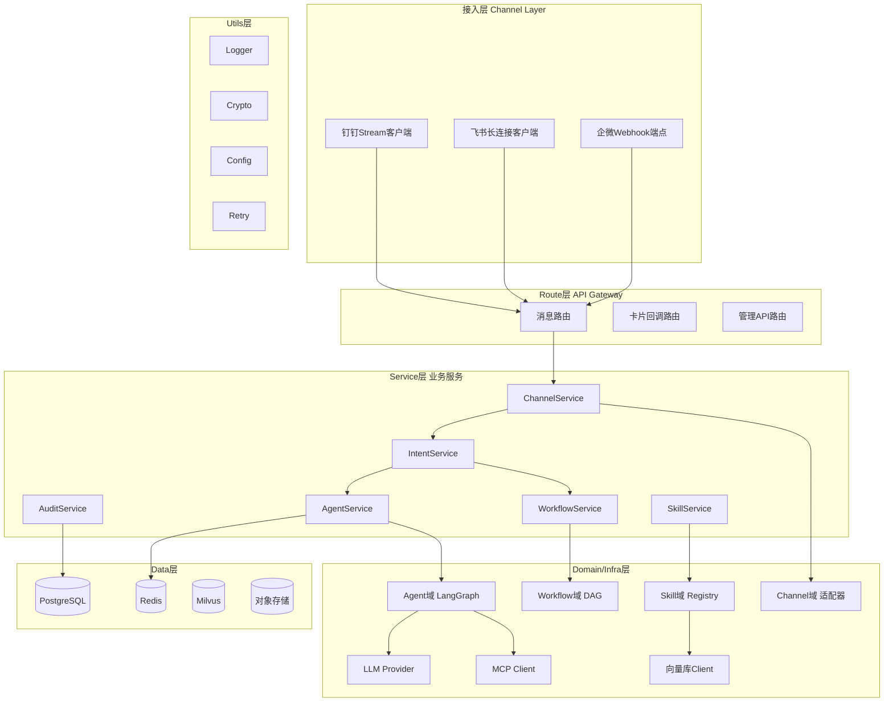
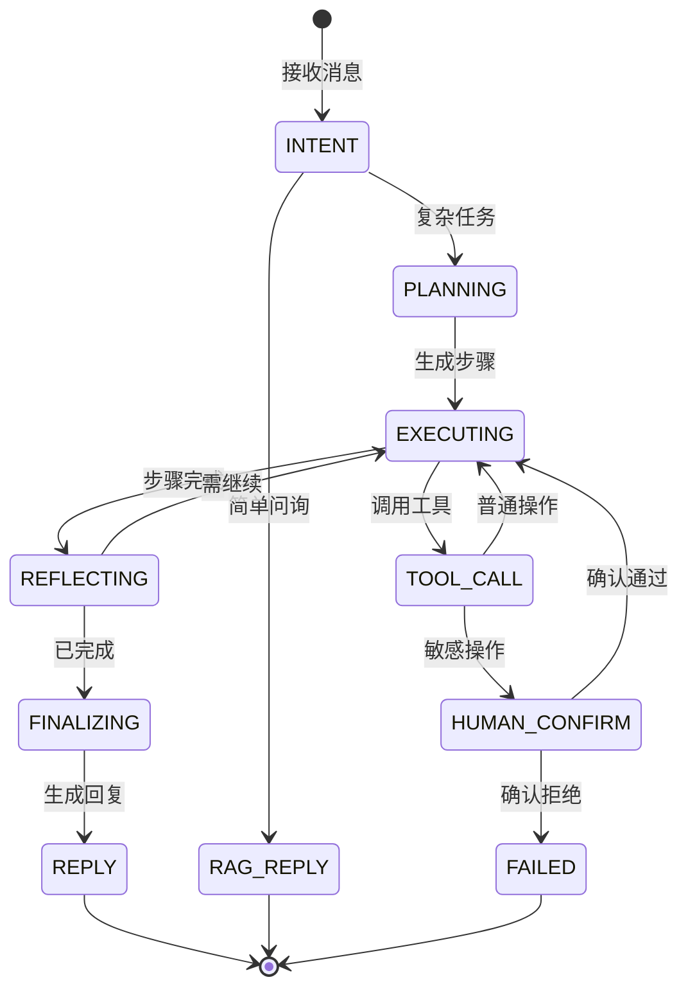

# MetaPivot 架构设计文档

> 企业内部多IM渠道自动化办公服务 —— 生产级架构设计

## 一、设计原则

1. **编排不实现**：架构分层清晰，每层职责单一，依赖方向严格向下
2. **异步优先**：所有IO操作异步，禁止阻塞主线程
3. **可信执行**：敏感操作Human-in-the-Loop，全程审计可回滚
4. **能力可扩展**：MCP/Skill/Function Call三层能力体系，热插拔
5. **私有化优先**：数据不出内网，全栈私有化部署

## 二、架构模式选型

### 选型结论：三层融合架构

```
┌─────────────────────────────────────────────────┐
│  Layer 3: 超级Agent（自主规划，LangGraph StateGraph）│  ← 不可枚举任务
├─────────────────────────────────────────────────┤
│  Layer 2: 有状态工作流（可视化编排，DAG+状态机）     │  ← 确定性流程+HITL
├─────────────────────────────────────────────────┤
│  Layer 1: Pipeline（RAG自动回复，无状态）            │  ← 简单问答
└─────────────────────────────────────────────────┘
```

### 选型理由（基于Anthropic "Building Effective Agents"哲学）

- **从简单开始**：80%场景Pipeline足够，Agent是最后手段
- **避免多Agent成本爆炸**：单超级Agent统管+路由，多Agent成本10-30x
- **HITL原生支持**：LangGraph checkpoint+interrupt，关键操作暂停等人工确认
- **Claude Code/Cursor实战验证**：超级Agent+工具调用+人工确认是生产级成熟范式

## 三、整体架构图



## 四、分层职责（依赖方向严格向下）

| 层 | 职责 | 关键模块 | 规则 |
|----|------|----------|------|
| **Route** | 请求接收/参数校验/响应封装 | message_route / card_callback_route / admin_route | 不含业务逻辑，仅路由分发 |
| **Service** | 业务编排 | ChannelService / IntentService / AgentService / WorkflowService / SkillService / AuditService | 调用Domain能力，不直接操作外部 |
| **Domain** | 领域核心逻辑 | Agent域 / Workflow域 / Skill域 / Channel域 | 纯函数+领域模型，无IO |
| **Infra** | 外部依赖实现 | LLMProvider / MCPClient / VectorStoreClient / IMClient | 实现Domain定义的接口 |
| **Data** | 持久化 | PostgreSQL / Redis / Milvus / 对象存储 | 仅Data层操作存储 |
| **Utils** | 通用工具 | Logger / Crypto / Config / Retry | 被任意层调用 |

## 五、超级Agent设计

### 状态机（LangGraph StateGraph）



### 核心组件

| 组件 | 职责 | 实现要点 |
|------|------|----------|
| **Planner** | 自然语言→步骤列表 | LLM Plan-Execute，输出结构化JSON |
| **Executor** | 逐步执行工具 | LangGraph节点，调用MCP/Skill/FC |
| **Memory** | 短期+长期记忆 | Redis短期+Milvus长期+checkpoint |
| **Router** | 意图分类+模式选择 | LLM分类器+规则 |
| **HITL** | 敏感操作暂停 | LangGraph interrupt + IM确认卡片 |
| **Reflector** | 步骤后评估 | LLM判断继续/重试/终止 |
| **Guardrail** | 输入输出风控 | 前置过滤+后置校验 |

### 生产级约束

- `max_steps = 10`（防止无限循环）
- 工具数量 ≤ 7（单次决策，超过则分组路由）
- `max_retries = 3`（单步重试上限）
- 每步审计日志（输入/输出/耗时/Tool）
- FallbackHandler：LLM失败→降级到规则回复

## 六、双模式执行设计

### 统一抽象：ExecutionPlan

```python
class ExecutionPlan:
    """工作流和Agent统一抽象"""
    plan_id: str
    mode: Literal["workflow", "agent"]
    steps: List[Step]
    status: Literal["pending","running","paused","done","failed"]
    checkpoints: List[Checkpoint]
```

### 互转机制

- **Workflow → Agent**：工作流遇"动态决策节点"→切换Agent模式自主规划剩余
- **Agent → Workflow**：Agent规划完成后，步骤可固化→提示保存为工作流模板

### 模式选择策略

- @机器人 + 关键词触发（"请假/报销"）→ Workflow
- 描述复杂需求 → Agent
- 管理员后台编排 → Workflow编辑器

## 七、MCP/Skill/Function Call三层能力体系

### 三层抽象

```
┌──────────────────────────────────┐
│ Layer A: Skill（业务级能力）        │  ← 面向用户配置
│   - 请假审批Skill、工单创建Skill    │
│   - 可由多个Tool组合               │
├──────────────────────────────────┤
│ Layer B: MCP Server（协议级能力）   │  ← 标准协议，热插拔
│   - 内部系统MCP、第三方MCP         │
├──────────────────────────────────┤
│ Layer C: Function Call（原子工具）  │  ← LLM直接调用
│   - 由Skill/MCP动态生成           │
└──────────────────────────────────┘
```

### Skill Registry 数据模型

| 字段 | 类型 | 说明 |
|------|------|------|
| skill_id | str | 唯一ID |
| name | str | 业务名 |
| description | str | LLM可读描述 |
| input_schema | JSON | 参数Schema |
| source_type | enum | mcp/function/workflow |
| source_ref | str | MCP Server名/函数引用/工作流ID |
| permission | str | 所需权限标签 |
| require_confirm | bool | 是否需要HITL |
| enabled | bool | 启用状态 |

### 热插拔实现

- Skill Registry存PostgreSQL，状态变更通过Redis Pub/Sub通知刷新
- MCP Server通过`mcp` Python SDK动态连接，断线重连
- 新增Skill无需重启，Agent下次决策自动感知

## 八、三端IM统一网关

### Channel适配器模式

```python
class ChannelAdapter(ABC):
    """统一Channel接口"""
    @abstractmethod
    async def receive_message(self, raw: dict) -> UnifiedMessage: ...
    
    @abstractmethod
    async def send_message(self, msg: UnifiedMessage) -> None: ...
    
    @abstractmethod
    async def send_card(self, card: UnifiedCard) -> None: ...
    
    @abstractmethod
    async def update_card(self, card_id: str, updates: dict) -> None: ...
```

### UnifiedMessage 统一消息抽象

| 字段 | 说明 |
|------|------|
| msg_id | 全局唯一（前缀+原始ID） |
| channel | dingtalk / wecom / feishu |
| chat_id | 会话ID（统一映射） |
| sender | 用户对象（统一user_id+原始ID） |
| text | 文本内容 |
| mentions | @列表 |
| files | 文件列表 |
| timestamp | 毫秒时间戳 |

### 三端实现差异

| 维度 | 钉钉 | 飞书 | 企微 |
|------|------|------|------|
| 接入 | Stream(WebSocket) | 长连接(WebSocket) | Webhook(HTTPS+AES) |
| 凭证 | ClientID+Secret | AppID+Secret | CorpID+Secret+Token+AESKey |
| 卡片 | 互动卡片(STREAM) | 消息卡片(回传) | 模板卡片(response_code) |
| 适配器 | DingtalkAdapter | FeishuAdapter | WecomAdapter |

## 九、安全与权限模型

### RBAC + ABAC 混合

```python
class PermissionChecker:
    """RBAC（角色）+ ABAC（属性策略）"""
    async def check(self, user: User, skill: Skill, context: Context) -> bool:
        if not self.rbac_allow(user.role, skill.permission):
            return False
        if not self.abac_evaluate(user, skill, context):
            return False
        return True
```

### HITL落地

- Skill配置`require_confirm=true` → Agent执行前`interrupt`
- 发送IM确认卡片（确认/拒绝/修改按钮）
- 用户点击→卡片回调→恢复状态机
- 超时（5分钟）自动终止+通知

### 审计与回滚

- **审计日志**：全量记录（操作人/时间/输入哈希/输出摘要/Tool/耗时），留存6个月+
- **回滚机制**：关键Skill定义`rollback_handler`，执行前快照，失败/拒绝时回滚
- **数据脱敏**：Utils层`Crypto.desensitize()`自动脱敏

## 十、技术栈定型

| 层 | 选型 | 理由 |
|----|------|------|
| Web框架 | FastAPI | 异步原生，OpenAPI自动生成 |
| Agent | LangGraph | checkpoint+HITL+状态机，生产级 |
| LLM SDK | OpenAI兼容 | Kimi/Qwen/GLM均兼容 |
| MCP SDK | mcp + FastMCP | 官方+生态流行 |
| 数据库 | PostgreSQL | 元数据/审计/工作流 |
| 缓存 | Redis | 会话/限流/PubSub |
| 向量库 | Milvus | RAG知识库 |
| 任务队列 | Celery + Redis | 异步任务，禁止阻塞主线程 |
| 日志 | loguru | 文件轮转，保留3天 |
| 部署 | Docker Compose | 私有化一键部署 |

## 十一、关键技术风险与缓解

| 风险 | 架构缓解 |
|------|----------|
| 3-5秒IM响应超时 | 异步架构：立即ACK→异步处理→主动推送；流式卡片渐进更新 |
| LLM幻觉 | Guardrail前置后置校验 + RAG增强 + 输出结构化 + 写操作强制HITL + Fallback |
| Agent循环 | max_steps=10 + 工具去重 + Reflector评估 + 超时熔断 |
| 三端API频次限制 | Redis令牌桶 + 消息合并 + 高频去重 + 钉钉扩容建议 |
| 私有化安全 | 全内网无外联 + 权重双哈希校验 + 审计≥6月 + 等保2.0三级 |
