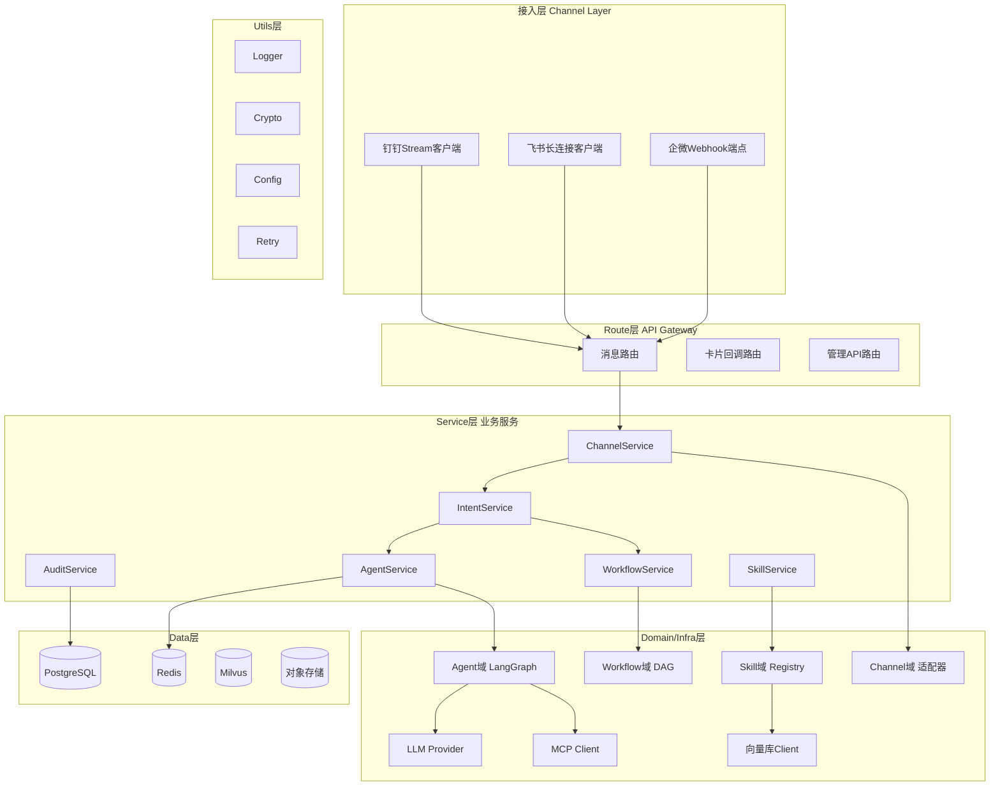
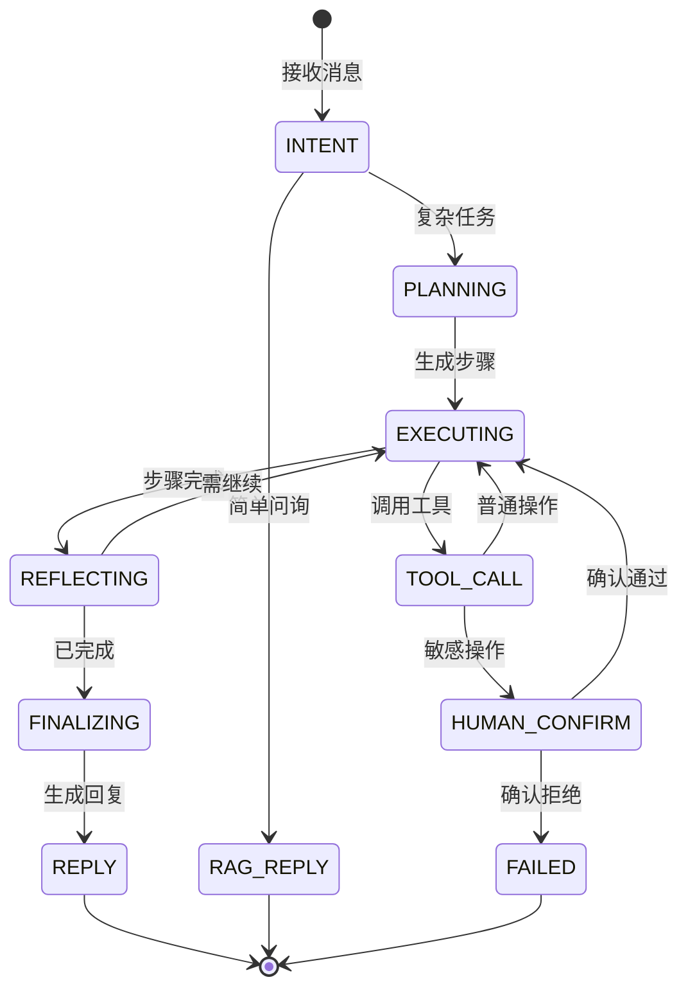

# MetaPivot 架构设计文档

> 企业内部多IM渠道自动化办公服务 —— 生产级架构设计

## 一、设计原则

1. **编排不实现**：架构分层清晰，每层职责单一，依赖方向严格向下
2. **异步优先**：所有IO操作异步，禁止阻塞主线程
3. **可信执行**：敏感操作Human-in-the-Loop，全程审计可回滚
4. **能力可扩展**：MCP/Skill/Function Call三层能力体系，热插拔
5. **私有化优先**：数据不出内网，全栈私有化部署

## 二、架构模式选型

### 选型结论：三层融合架构

```
┌─────────────────────────────────────────────────┐
│  Layer 3: 超级Agent（自主规划，LangGraph StateGraph）│  ← 不可枚举任务
├─────────────────────────────────────────────────┤
│  Layer 2: 有状态工作流（可视化编排，DAG+状态机）     │  ← 确定性流程+HITL
├─────────────────────────────────────────────────┤
│  Layer 1: Pipeline（RAG自动回复，无状态）            │  ← 简单问答
└─────────────────────────────────────────────────┘
```

### 选型理由（基于Anthropic "Building Effective Agents"哲学）

- **从简单开始**：80%场景Pipeline足够，Agent是最后手段
- **避免多Agent成本爆炸**：单超级Agent统管+路由，多Agent成本10-30x
- **HITL原生支持**：LangGraph checkpoint+interrupt，关键操作暂停等人工确认
- **Claude Code/Cursor实战验证**：超级Agent+工具调用+人工确认是生产级成熟范式

## 三、整体架构图



## 四、分层职责（依赖方向严格向下）

| 层 | 职责 | 关键模块 | 规则 |
|----|------|----------|------|
| **Route** | 请求接收/参数校验/响应封装 | message_route / card_callback_route / admin_route | 不含业务逻辑，仅路由分发 |
| **Service** | 业务编排 | ChannelService / IntentService / AgentService / WorkflowService / SkillService / AuditService | 调用Domain能力，不直接操作外部 |
| **Domain** | 领域核心逻辑 | Agent域 / Workflow域 / Skill域 / Channel域 | 纯函数+领域模型，无IO |
| **Infra** | 外部依赖实现 | LLMProvider / MCPClient / VectorStoreClient / IMClient | 实现Domain定义的接口 |
| **Data** | 持久化 | PostgreSQL / Redis / Milvus / 对象存储 | 仅Data层操作存储 |
| **Utils** | 通用工具 | Logger / Crypto / Config / Retry | 被任意层调用 |

## 五、超级Agent设计

### 状态机（LangGraph StateGraph）



### 核心组件

| 组件 | 职责 | 实现要点 |
|------|------|----------|
| **Planner** | 自然语言→步骤列表 | LLM Plan-Execute，输出结构化JSON |
| **Executor** | 逐步执行工具 | LangGraph节点，调用MCP/Skill/FC |
| **Memory** | 短期+长期记忆 | Redis短期+Milvus长期+checkpoint |
| **Router** | 意图分类+模式选择 | LLM分类器+规则 |
| **HITL** | 敏感操作暂停 | LangGraph interrupt + IM确认卡片 |
| **Reflector** | 步骤后评估 | LLM判断继续/重试/终止 |
| **Guardrail** | 输入输出风控 | 前置过滤+后置校验 |

### 生产级约束

- `max_steps = 10`（防止无限循环）
- 工具数量 ≤ 7（单次决策，超过则分组路由）
- `max_retries = 3`（单步重试上限）
- 每步审计日志（输入/输出/耗时/Tool）
- FallbackHandler：LLM失败→降级到规则回复

## 六、双模式执行设计

### 统一抽象：ExecutionPlan

```python
class ExecutionPlan:
    """工作流和Agent统一抽象"""
    plan_id: str
    mode: Literal["workflow", "agent"]
    steps: List[Step]
    status: Literal["pending","running","paused","done","failed"]
    checkpoints: List[Checkpoint]
```

### 互转机制

- **Workflow → Agent**：工作流遇"动态决策节点"→切换Agent模式自主规划剩余
- **Agent → Workflow**：Agent规划完成后，步骤可固化→提示保存为工作流模板

### 模式选择策略

- @机器人 + 关键词触发（"请假/报销"）→ Workflow
- 描述复杂需求 → Agent
- 管理员后台编排 → Workflow编辑器

## 七、MCP/Skill/Function Call三层能力体系

### 三层抽象

```
┌──────────────────────────────────┐
│ Layer A: Skill（业务级能力）        │  ← 面向用户配置
│   - 请假审批Skill、工单创建Skill    │
│   - 可由多个Tool组合               │
├──────────────────────────────────┤
│ Layer B: MCP Server（协议级能力）   │  ← 标准协议，热插拔
│   - 内部系统MCP、第三方MCP         │
├──────────────────────────────────┤
│ Layer C: Function Call（原子工具）  │  ← LLM直接调用
│   - 由Skill/MCP动态生成           │
└──────────────────────────────────┘
```

### Skill Registry 数据模型

| 字段 | 类型 | 说明 |
|------|------|------|
| skill_id | str | 唯一ID |
| name | str | 业务名 |
| description | str | LLM可读描述 |
| input_schema | JSON | 参数Schema |
| source_type | enum | mcp/function/workflow |
| source_ref | str | MCP Server名/函数引用/工作流ID |
| permission | str | 所需权限标签 |
| require_confirm | bool | 是否需要HITL |
| enabled | bool | 启用状态 |

### 热插拔实现

- Skill Registry存PostgreSQL，状态变更通过Redis Pub/Sub通知刷新
- MCP Server通过`mcp` Python SDK动态连接，断线重连
- 新增Skill无需重启，Agent下次决策自动感知

## 八、三端IM统一网关

### Channel适配器模式

```python
class ChannelAdapter(ABC):
    """统一Channel接口"""
    @abstractmethod
    async def receive_message(self, raw: dict) -> UnifiedMessage: ...
    
    @abstractmethod
    async def send_message(self, msg: UnifiedMessage) -> None: ...
    
    @abstractmethod
    async def send_card(self, card: UnifiedCard) -> None: ...
    
    @abstractmethod
    async def update_card(self, card_id: str, updates: dict) -> None: ...
```

### UnifiedMessage 统一消息抽象

| 字段 | 说明 |
|------|------|
| msg_id | 全局唯一（前缀+原始ID） |
| channel | dingtalk / wecom / feishu |
| chat_id | 会话ID（统一映射） |
| sender | 用户对象（统一user_id+原始ID） |
| text | 文本内容 |
| mentions | @列表 |
| files | 文件列表 |
| timestamp | 毫秒时间戳 |

### 三端实现差异

| 维度 | 钉钉 | 飞书 | 企微 |
|------|------|------|------|
| 接入 | Stream(WebSocket) | 长连接(WebSocket) | Webhook(HTTPS+AES) |
| 凭证 | ClientID+Secret | AppID+Secret | CorpID+Secret+Token+AESKey |
| 卡片 | 互动卡片(STREAM) | 消息卡片(回传) | 模板卡片(response_code) |
| 适配器 | DingtalkAdapter | FeishuAdapter | WecomAdapter |

## 九、安全与权限模型

### RBAC + ABAC 混合

```python
class PermissionChecker:
    """RBAC（角色）+ ABAC（属性策略）"""
    async def check(self, user: User, skill: Skill, context: Context) -> bool:
        if not self.rbac_allow(user.role, skill.permission):
            return False
        if not self.abac_evaluate(user, skill, context):
            return False
        return True
```

### HITL落地

- Skill配置`require_confirm=true` → Agent执行前`interrupt`
- 发送IM确认卡片（确认/拒绝/修改按钮）
- 用户点击→卡片回调→恢复状态机
- 超时（5分钟）自动终止+通知

### 审计与回滚

- **审计日志**：全量记录（操作人/时间/输入哈希/输出摘要/Tool/耗时），留存6个月+
- **回滚机制**：关键Skill定义`rollback_handler`，执行前快照，失败/拒绝时回滚
- **数据脱敏**：Utils层`security.desensitize()` 自动脱敏（身份证/手机/邮箱/银行卡 Luhn 校验）

### P0 安全加固（已实施）

**AES-CBC-256 加密**（`app/utils/security.py`）
- 随机 IV（`os.urandom(16)`）前置于密文 + SHA-256 派生密钥
- `encrypt_aes` / `decrypt_aes` 配对，输出格式 `iv(16B) || ciphertext`

**JWT kid 密钥轮换**（`app/utils/security.py`）
- `create_access_token` 注入 `kid` header，`decode_access_token` 支持 primary/previous 多密钥并行校验
- 向后兼容（无 kid 走 primary）+ 主密钥失败 fallback previous（grace period）
- 轮换配置：`JWT_SECRET` + `JWT_SECRET_PREVIOUS` + `JWT_KID_PRIMARY`

**Guardrail 输入输出脱敏**（`app/domain/agent/guardrail.py`）
- 输入侧：PII 脱敏 4 类 + prompt injection 命中即阻断（返回安全文本，不抛异常）
- 输出侧：敏感关键词 11 个替换为 `***`，覆盖 `replier_node`（非流式）+ `_stream_final_reply`（流式）双路径

**用户维度限流**（`app/middleware/rate_limit.py`）
- Redis Lua 真令牌桶（原子 refill + consume + retry_after 计算）
- 限流维度：优先 `user:{jwt_sub}`，无 token 走 `ip:{client_ip}`
- 动态 Retry-After（429 header + JSON body）+ 缓存故障降级为不限流

## 十、技术栈定型

| 层 | 选型 | 理由 |
|----|------|------|
| Web框架 | FastAPI | 异步原生，OpenAPI自动生成 |
| Agent | LangGraph | checkpoint+HITL+状态机，生产级 |
| LLM SDK | OpenAI兼容 | Kimi/Qwen/GLM均兼容 |
| MCP SDK | mcp + FastMCP | 官方+生态流行 |
| 数据库 | PostgreSQL | 元数据/审计/工作流 |
| 缓存 | Redis | 会话/限流/PubSub |
| 向量库 | Milvus | RAG知识库 |
| 任务队列 | Celery + Redis | 异步任务，禁止阻塞主线程 |
| 日志 | loguru | 文件轮转保留3天，`APP_LOG_FORMAT=json` 输出 ELK/Loki 友好结构化日志 |
| 指标 | prometheus_client | `/metrics` 端点暴露 HTTP/Agent/LLM/Skill/Workflow 5 组业务指标 |
| 部署 | Docker Compose | 私有化一键部署 |

## 十一、关键技术风险与缓解

| 风险 | 架构缓解 |
|------|----------|
| 3-5秒IM响应超时 | 异步架构：立即ACK→异步处理→主动推送；流式卡片渐进更新 |
| LLM幻觉 | Guardrail前置后置校验 + RAG增强 + 输出结构化 + 写操作强制HITL + Fallback |
| Agent循环 | max_steps=10 + 工具去重 + Reflector评估 + 超时熔断 |
| 三端API频次限制 | Redis令牌桶 + 消息合并 + 高频去重 + 钉钉扩容建议 |
| 私有化安全 | 全内网无外联 + 权重双哈希校验 + 审计≥6月 + 等保2.0三级 |

## 十二、监控与可观测性

### 三层可观测体系

```
┌─────────────────────────────────────────────┐
│ Metrics（指标）— Prometheus /metrics         │  ← 系统健康度，告警依据
│   HTTP/Agent/LLM/Skill/Workflow 5 组指标      │
├─────────────────────────────────────────────┤
│ Logs（日志）— loguru JSON sink                │  ← 故障排查，根因定位
│   request_id/trace_id/user_id 跨任务传播     │
├─────────────────────────────────────────────┤
│ Traces（追踪）— SSE 节点级事件流               │  ← 链路可见，实时调试
│   step_started/llm_call/stuck_detected 等     │
└─────────────────────────────────────────────┘
```

### 指标注入点

| 注入位置 | 文件 | 采集内容 |
|---------|------|---------|
| HTTP 中间件 | `app/middleware/metrics_middleware.py` | method/path/status/duration（路径归一化） |
| Agent 任务 | `app/service/agent_service.py`（_run_task finally + cancel_task） | 任务总数、活跃数、耗时、Token |
| LLM 调用 | `app/domain/agent/executor.py`（record_llm_metrics helper） | model/status/duration、Token prompt/completion |
| Skill 调用 | `app/service/skill_service.py` | skill_name/status |
| 工作流执行 | `app/service/workflow_service.py` | status |

### Agent 状态机可见性

节点通过 `state.add_event()` 累积事件，`graph._drain_events()` 在每个节点执行后 drain 到 SSE，保证节点级事件到达订阅者（原本只到 `state.events` 内部）：

```
intent_node → step_started{step:intent} / llm_call{usage} / step_completed
planner_node → step_started{step:planning} / step_completed
executor_node → step_started / llm_call{duration,usage} / tool_call / human_confirm_required / stuck_detected / step_completed
reflector_node → reflected{status}
replier_node → final_result{answer,usage}
```

### FAILED 状态快速结束

`graph.run_agent` 在 executor/reflector 返回 `FAILED` 时直接 yield `final_result` 并 return，跳过 `_stream_final_reply` 和 `replier_node`（避免 tenacity 重试拖慢 finally 块的 `record_agent_task` 执行，使任务指标能及时出现在 `/metrics`）。

### 任务时序字段

`AgentTaskORM` 增加 `finished_at` / `duration_ms` 字段：
- `created_at` — 任务创建（`create_task` 时设置）
- `updated_at` — 状态变更（每次 `update_task_status` 时更新）
- `finished_at` — 接近终态（`update_task_status` 在 try/except 块设置）
- `duration_ms` — ORM `__init__` 计算的 `finished_at - created_at` 毫秒数

### 十三、定时任务调度（Phase 5）

#### NL→cron 三层解析架构

用户在 IM 对话中表达定时意图时，Agent 走三层解析：

1. **L1 正则预筛**（`app/domain/agent/cron_regex.py`）
   - 覆盖约 70% 高频中文时间模式
   - 支持：每天/每日/工作日/周末/每周X/每月X号/每小时/每N分钟/每N小时
   - 上午/下午修饰：`下午 3 点` → 15:00
   - 命中即直接输出 cron_expr，避免 LLM 成本

2. **L2 LLM 解析**（`app/domain/agent/schedule_parser.py::_llm_parse`）
   - L1 未命中时调用 LLM
   - 输出含 `cron_expr` 优先于 `recurring`
   - LLM 输出的 cron_expr 经 `cron_helper.is_valid_cron` 校验，无效则降级到 recurring

3. **L3 关键词兜底**（`schedule_parser._keyword_parse`）
   - LLM 不可用时降级为关键词规则匹配
   - 输出 recurring=none/daily/weekly/monthly + run_at

#### AsyncScheduler 设计

**单进程零外部依赖**（适合小企业单机部署）：
- 基于 `asyncio` + DB 轮询（`_POLL_INTERVAL=30s`）
- 触发执行调用 `AgentService.start_task`（asyncio.create_task 异步非阻塞）
- 不依赖 Redis/Celery

**Phase 5 增强**：
- **cron_expr 优先**：`schedule()` 接受 `cron_expr` 参数，优先用 `croniter` 计算 `next_run_at`，比 `timedelta(days=1)` 精确（跨月/闰年/工作日）
- **DLQ + 指数退避**：`_handle_failure` 失败时 `retry_count += 1`，`< max_retries`（默认 3）按 `2^n * 60s` 退避重试，`>= max_retries` 进入 DLQ
- **PostgreSQL 多实例防重**：`_trigger_due_tasks` 在 PostgreSQL 后端用 `SELECT ... FOR UPDATE SKIP LOCKED`，SQLite 单机无需

#### DLQ 死信队列

| 状态 | 触发条件 | 处理方式 |
|------|---------|---------|
| `pending` | 创建/重试入队 | 等待 `next_run_at` 到期 |
| `running` | 被轮询拉取 | 标记防重 + 异步执行 |
| `completed` | 一次性任务执行成功 | 终态 |
| `failed` | `retry_count >= max_retries` | 进入 DLQ，等待手动重试或放弃 |
| `cancelled` | 用户主动取消 | 终态 |

**DLQ API**：
- `GET /api/v1/schedules/dlq` 查询死信队列
- `POST /api/v1/schedules/dlq/{id}/retry` 重置 retry_count 重新入队
- `POST /api/v1/schedules/dlq/{id}/cancel` 放弃任务

判断任务是否真正结束应查 `finished_at` 非空（`status` 字段可能在循环中途被 `persist_state` 设为 `failed` 但任务还在执行）。

### 十四、记忆子系统（Phase 6）

#### IMemoryStore 契约（9 方法，分两层）

**基础层（6 方法，所有 backend 实现）**：
- `load_history(chat_id, limit)` / `append_message(...)` — episodic 顺序读写
- `get_summary(chat_id)` / `set_summary(...)` — 长对话压缩摘要
- `clear(chat_id)` / `health()` — GDPR 合规 / 健康检查

**语义扩展层（3 方法，默认 no-op，仅 SemanticMemoryStore 实现）**：
- `append_with_embedding(...)` — 存消息 + 计算 embedding 入向量库（双写）
- `search_semantic(query, chat_id, top_k)` — 跨会话语义召回
- `consolidate_memories(chat_id)` — Mem0 风格事实抽取

> 设计：基础层方法在 InMemoryMemoryStore / DBMemoryStore 用默认 no-op 实现，
> 保持 `isinstance(_, IMemoryStore)` 通过（`@runtime_checkable` Protocol 结构化校验）。

#### 三种 backend 部署规模

| MEMORY_BACKEND | 实现 | 向量库 | 适用场景 |
|----------------|------|--------|---------|
| `memory` | InMemoryMemoryStore | 无 | 开发环境，零依赖，重启丢失 |
| `db` | DBMemoryStore | 无 | 生产环境，SQLite/PostgreSQL 持久化，仅 episodic 顺序读 |
| `semantic` | SemanticMemoryStore | IVectorStore（chroma/local/milvus） | 跨会话语义关联 + 事实抽取 |

#### SemanticMemoryStore 设计（episodic + semantic 双层）

参考 LangMem 三类记忆模型 + Mem0 双阶段事实抽取：

- **episodic（事件记忆）**：委托 DBMemoryStore 存原始消息（ChatMessageORM，顺序读）
- **semantic（语义记忆）**：消息 embedding + 事实抽取，存 IVectorStore `agent_memory` collection
  - `append_with_embedding`：双写 DB（原文）+ 向量库（embedding），单一数据源
  - `search_semantic`：embed query → 向量检索 → 返回相关事实/消息（跨会话）
  - `consolidate_memories`：LLM 从最近对话抽取事实三元组（省 90% token），带 `metadata.type="fact"`
- **procedural（过程记忆）**：复用 episodic 顺序 + semantic 召回（暂不独立存储）

#### Chroma 双角色

Chroma 同时承担两个职责（`VECTOR_BACKEND=chroma` + `MEMORY_BACKEND=semantic`）：
1. **IVectorStore backend（RAG）**：`knowledge_chunks` collection 存文档分块向量
2. **IMemoryStore 语义扩展**：`agent_memory` collection 存消息 embedding + 事实

collection 命名空间隔离，避免 RAG 与 memory 数据混淆：
- `knowledge_chunks` — RAG 文档检索
- `agent_memory` — 语义记忆（消息 + 事实）
- `tool_index` — Phase 6 Tool RAG 工具索引

#### 集成点（AgentService）

- `_run_task` 加载历史时：先 `load_history`（episodic）+ 若 semantic backend 再 `search_semantic(message, chat_id)` 补充相关记忆，作为 system 消息前置注入
- `_persist_to_memory`：semantic backend 用 `append_with_embedding`（双写），非 semantic 降级为 `append_message`
- 会话结束触发 `_maybe_consolidate`（fire-and-forget，每 N 条消息触发一次事实抽取）
- API：`POST /api/v1/agent/memory/search` 暴露语义记忆检索能力

#### 容错与降级

- LLM embed 失败：episodic 原文已存，semantic 向量失败 warning 不阻塞主链路
- chromadb 未安装：factory 降级为 LocalVectorStore（开发环境零依赖）
- 非 semantic backend 调用语义方法：返回 no-op（空列表 / 空操作），不报错
